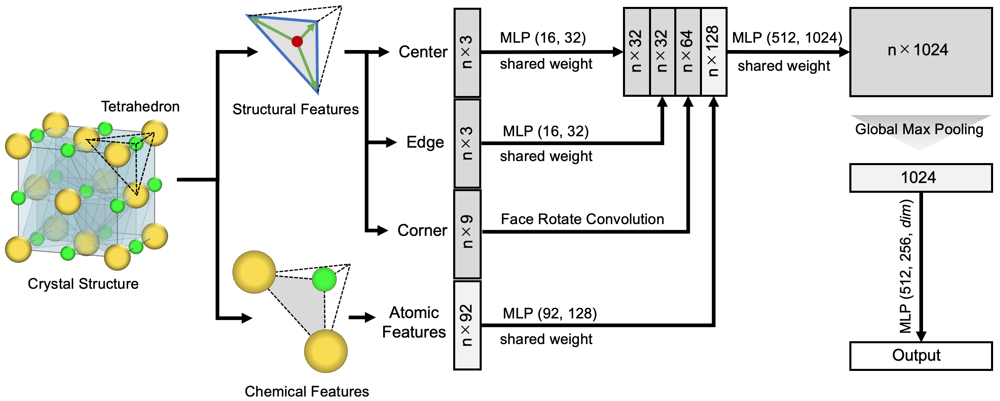

## DeepCrysTet: A Deep Learning Approach Using Tetrahedral Mesh for Predicting Properties of Crystalline Materials

DeepCrysTet is a novel deep learning approach for predicting material properties, which uses crystal structures represented as a 3D tetrahedral mesh generated by Delaunay tetrahedralization.
DeepCrysTet provides a useful framework comprising three core components: a 3D mesh generation method, mesh-based feature design, and neural network design.
The overall framework of DeepCrysTet is shown below.

## Table of Contents

- [Dataset](#dataset)
- [Citation](#citation)

## Dataset

The evaluation dataset generated from the [2018.10.18 version](https://figshare.com/articles/dataset/Materials_Project_Data/7227749) of the Materials Project dataset  used in the original DeepCrysTet paper can be downloaded here.

If you want to learn more about the data generation process or create your own 3D mesh dataset, more information can be found in the [data](data/) folder.

## Citation

TBD