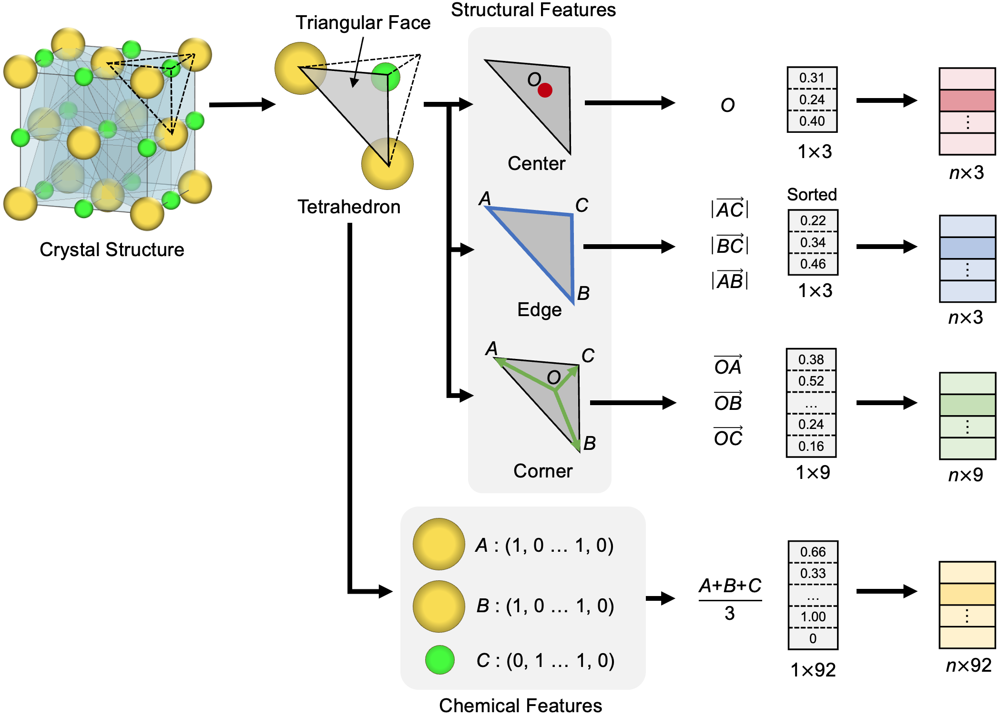

## Dataset Preparation

## Environment

We use [Poetry](https://python-poetry.org/) for managing our packages.
To get started, clone `DeepCrysTet` repository and run the following command from this directory.

```bash
poetry install --no-root
```

Run the following command to activate the environment:

```bash
poetry shell
```

## Step 1. Mesh Generation by Delaunay Tetrahedralization

We adopted Delaunay tetrahedralization to generate a 3D tetrahedral mesh of the crystal structure.
Delaunay tetrahedralization divides a 3D space into a set of tetrahedra from a given set of 3D vertices.
The resulting tetrahedral mesh was filled with tetrahedra without gaps inside the crystal structure.

### Use 2018.10.18 version of the Materials Project dataset

In the DeepCrysTet's paper, we used the [2018.10.18 version](https://figshare.com/articles/dataset/Materials_Project_Data/7227749) of the Materials Project dataset.
The created dataset is available [here](https://figshare.com/articles/dataset/3D_Mesh_Dataset_for_DeepCrysTet/22031969).  
If you want to create the same dataset manually, please execute the following commands.

```
python delaunay_3d_mesh.py --save-dir="./datasets" --dataset-name="mp_all_20181018"
```

Output files:
- delaunay_3d_mesh.npz
- id_prop_<target_property>.csv

### Use own cif files

Specify the directory where you put your own cif files as `data-dir` and execute the following command.

```
python delaunay_3d_mesh.py --save-dir="./datasets" --data-dir="./example"
```

Output files:
- delaunay_3d_mesh.npz

## Step 2. Feature Generation for input to DeepCrysTet

The mesh data generated by Delaunay tetrahedralization is a set of tetrahedra.
Because each tetrahedron consists of four triangular faces, the mesh data can also be regarded as a set of triangular faces.
To take advantage of a mesh that contains 3D connectivity between constituent atoms, we designed features of two types, structural and chemical, using the triangular faces as the basic units, as illustrated below.



The chemical features (listed in `atom_init.py`) were created in step 1.
The following command can generate all features, including structural features, for input to DeepCrysTet.

```
python preprocess.py --save-dir="./datasets" --data-path="./datasets/delaunay_3d_mesh.npz"
```

Output files:
- mp-3dmesh.npz
